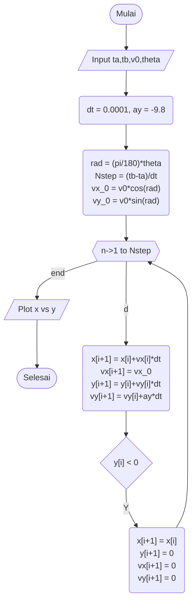
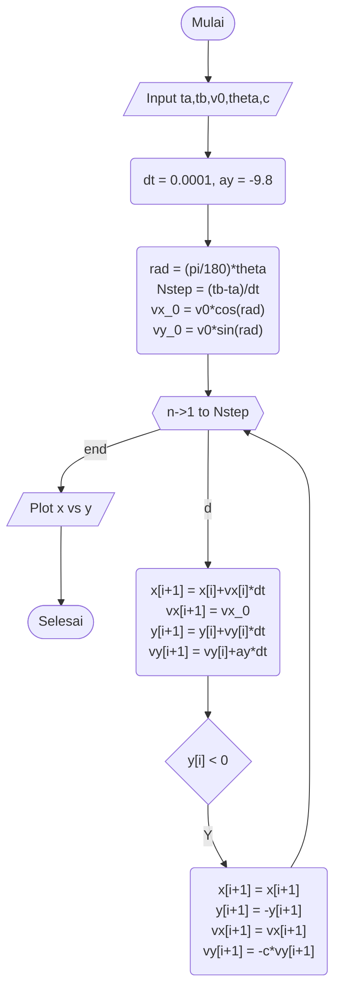
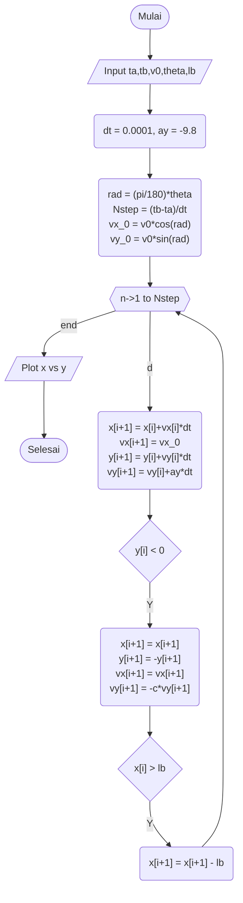
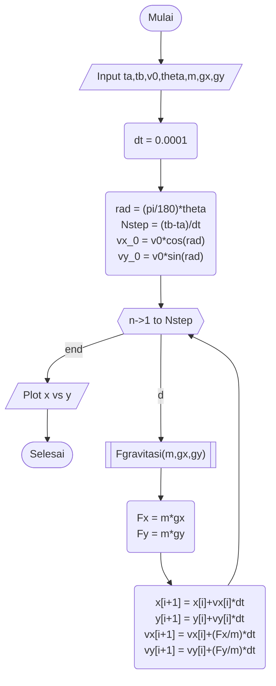
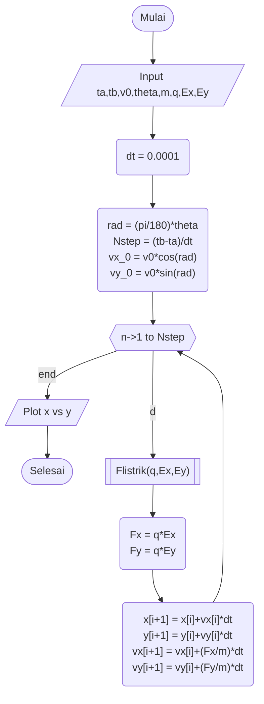
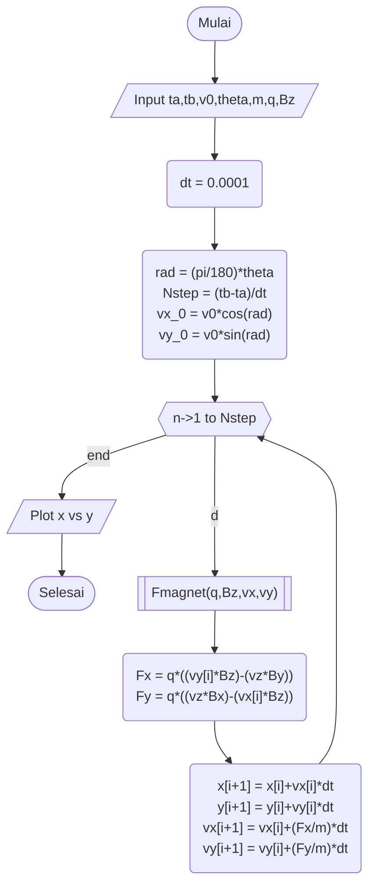

# Tugas 1 
# Fisika Komputasi
### Julian Evan Chrisnanto | 140310200025

Buatlah 3-buah Fungsi Syarat Batas dan 3-buah Gaya 
untuk kasus gerak peluru 2D. Buat Flowchart keseluruhannya 
1. Syarat Batas: 
    a. Berhenti, 
    b. Memantul, dan 
    c. Periodik/Warp Around 
2. Gaya: 
    a. Gravitasi, 
    b. Listrik, dan 
    c. Magnet 

# Kondisi 1 (Syarat Batas)
## a. Berhenti

## b. Memantul

## c. Periodik/Warp Around

# Kondisi 2 (Gaya Luar)
## a. Gravitasi

## b. Listrik

## c. Magnet

