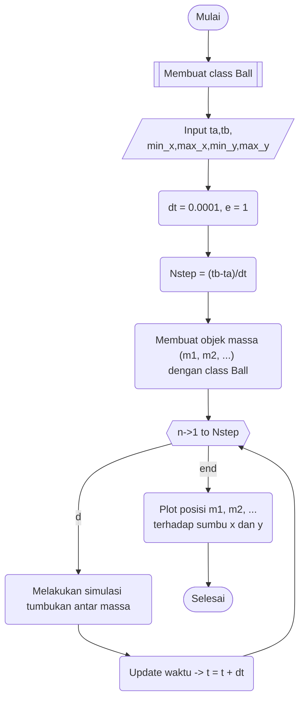
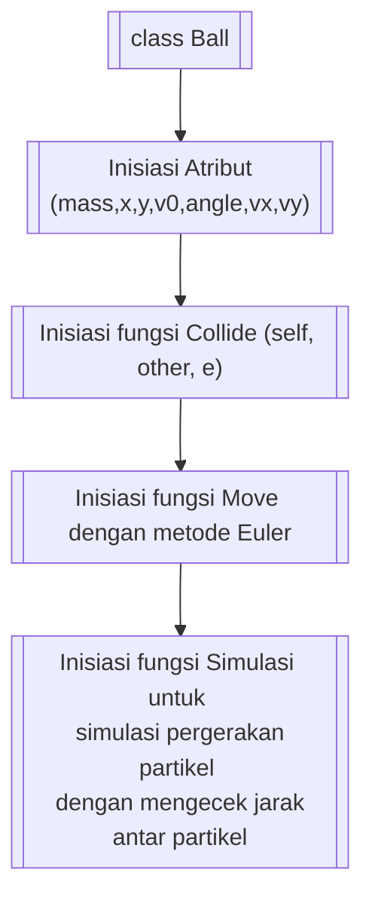

```mermaid
graph TD;
    A([Mulai])-->B[[Membuat class Ball]];
    B-->C[/Input ta,tb,<br>min_x,max_x,min_y,max_y/];
    C-->D(dt = 0.0001, e = 1);
    D-->E("Nstep = (tb-ta)/dt");
    E-->F("Membuat objek massa (m1, m2, ...) <br>dengan class Ball");
    F-->G{{n->1 to Nstep}};
    I-->G;
    G--do-->H(Melakukan simulasi tumbukan antar massa);
    H-->I(Update waktu -> t = t + dt);
    G--end-->J(Plot posisi m1, m2, ... <br>terhadap sumbu x dan y);
    J-->K([Selesai]);
```

```mermaid
graph TD;
  A[[class Ball]]-->B[["Inisiasi Atribut <br>(mass,x,y,v0,angle,vx,vy)"]];
  B-->C[["Inisiasi fungsi Collide (self, other, e)"]];
  C-->D[[Inisiasi fungsi Move dengan metode Euler]];
  D-->E[[Inisiasi fungsi Simulasi untuk <br> simulasi pergerakan partikel <br> dengan mengecek jarak antar partikel]];
```
